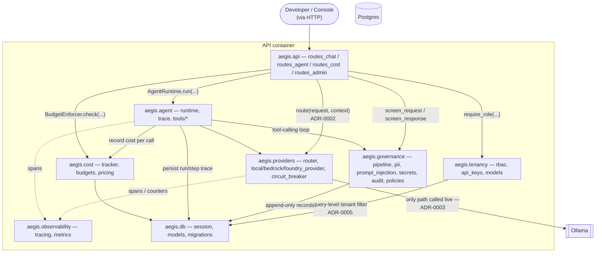

# C4 — Level 3: Components (inside the API container)

The FastAPI application from [container.md](container.md), broken into its actual Python
packages under `src/aegis/`. Every arrow here is a real import/call in the code, not aspirational.

## Notes

- **`aegis.governance` sits at every entry point that reaches a provider** — both
  `routes_chat.py` (single-shot chat) and `aegis.agent.runtime.AgentRuntime.run()` (agent loop)
  call `screen_request`/`screen_response` around the provider call, not just one or the other.
  This is why guardrails only need to be tested once at the pipeline level
  (`tests/unit/test_governance_*.py`) and then re-verified at each integration point, rather
  than re-implemented per entry point.
- **`aegis.tenancy.rbac`'s enforcement point is the database query**, not the route handler —
  `TraceStore.get_run`/`list_runs`/`replay` all take an optional `tenant_id` filter applied in
  the `WHERE` clause itself (see [ADR-0005](../adr/0005-rbac-enforced-at-query-layer.md)), which
  is why the arrow above goes `rbac → db`, not `rbac → api`.
- **`aegis.eval`** (the eval-gate harness, [ADR-0008](../adr/0008-eval-gate-golden-fixtures.md))
  is deliberately absent from this diagram — it's a CI/dev-time harness that exercises `agent`
  and `governance` from the outside, it is not a runtime component the API depends on.
