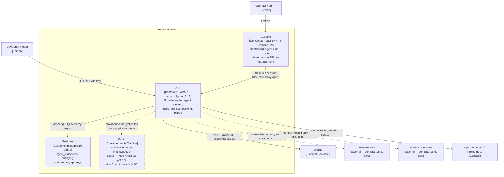

# C4 — Level 2: Containers

What's inside the "Aegis Gateway" box from [context.md](context.md), and how the pieces
actually deployed by `docker-compose.yml` talk to each other. See [component.md](component.md)
for what's inside the API container.

## Notes

- **Console → API** is the only path the console has — there is no separate console backend,
  no direct console→Postgres access, consistent with
  [ADR-0005](../adr/0005-rbac-enforced-at-query-layer.md): every access goes through the same
  RBAC-enforcing API layer regardless of caller.
- **Redis is deployed but not yet used** by any application code path (`src/aegis/` has no
  Redis client calls — only `config.py` defines `redis_url`). This is a known, documented gap
  (`docs/threat-model.md`, D1), not an oversight in this diagram.
- **Migrations are a separate step**, not part of the API container's startup (`docker compose
  exec api alembic upgrade head`) — see the root README's "Run it" section and
  [runbook.md](../runbook.md) for why (avoiding a migration race if the API ever scales to
  multiple replicas).
