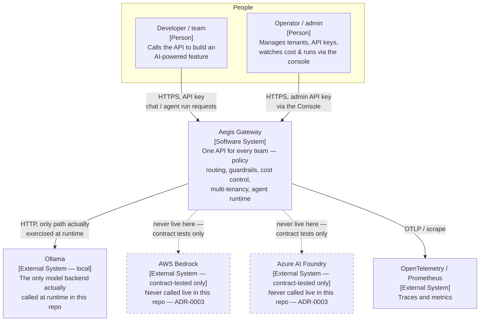

# C4 — Level 1: System Context

Who and what talks to Aegis, and what Aegis itself talks to. See
[container.md](container.md) for what's inside the "Aegis Gateway" box.

## Notes

- **Solid arrows** are calls that actually happen when you run this repository (`docker compose
  up`, CI). **Dashed arrows** to Bedrock/Foundry are calls that exist in fully-implemented code
  (`BedrockProvider`, `FoundryProvider`) but are only exercised against recorded fixtures in
  `tests/contract/` — see [ADR-0003](../adr/0003-local-first-contract-testing.md).
- The Operator's path through the Console (`console/`) still terminates at the same Aegis API —
  the console has no backend of its own, it's a pure client (see
  [container.md](container.md)).
